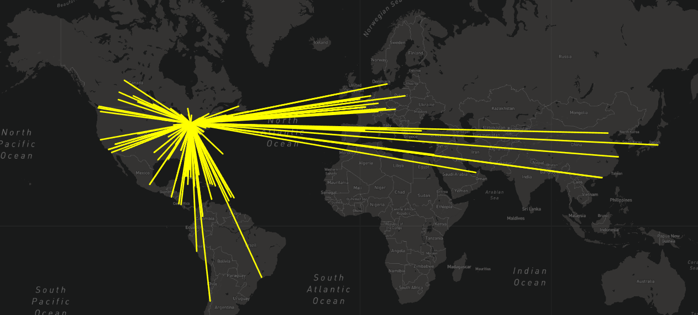

# Mapping_Earthquakes

## Overview & Purpose

The purpose of this project is to build insightful data visualizations with interactive features using the latest earthquake geoJSON data from the US Geological Survey website. To complete this project, I have used URL for GeoJSON earthquake data from the USGS website and retrived geographical co-ordinates and the magnitudes of earthquakes for the last seven days using the JS and D3.js libraries. The Leaflet library has been used to plot the data on a Mapbox map through an API request to create interactivity.

## Tools Used
- JavaScript
- D3
- Leaflet
- Mapbox
- HTML

## Challenge - Deliverable 1 (Tectonic Plates)

## Challenge - Deliverable 2 (Major Earthquakes)

## Challenge - Deliverable 3 (Dark Map)

## Practice Modules

#### Mapping GeoJSON Points (Major Airports)

#### Mapping Lines (Flight Route SFO-Austin-Toronto-New York)

#### Mapping Linestrings (Flights from Toronto)

#### Mapping Polygons (Toronto Neighbourhoods)

#### Mapping Earthquakes

